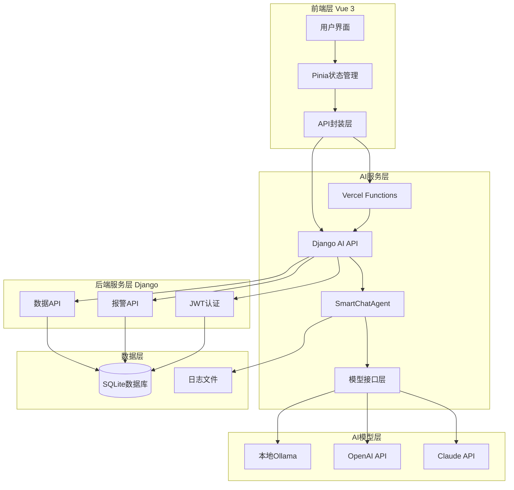
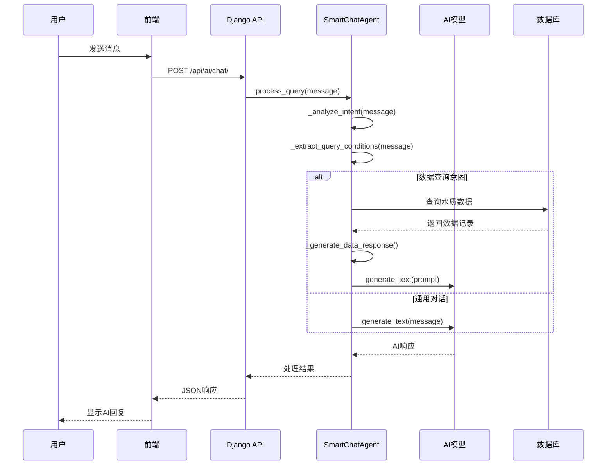
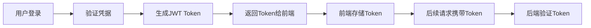

# 水质监控系统技术设计文档

## 1. 项目概述

### 1.1 系统定位
水质监控系统是一个基于 Vue 3 + Django 的现代化水质监测管理平台，集成了 AI 智能问答、数据可视化、异常报警等核心功能，为水质监测人员提供一站式数据管理和决策支持服务。

### 1.2 核心价值
- **智能化**：通过 AI 意图识别和自然语言处理，降低数据查询门槛
- **实时性**：支持流式 AI 对话和实时数据展示
- **可扩展性**：多模型 AI 架构支持本地和云端模型切换
- **易用性**：直观的 Web 界面和智能化的数据交互

### 1.3 技术特色
- 支持 11 种智能意图识别（数据查询、健康评估、运维查询等）
- 动态实体提取（监测点、时间、指标、地理位置）
- 完整的请求链路日志追踪
- 流式 AI 对话体验

## 2. 技术架构图

### 2.1 系统整体架构



### 2.2 AI对话流程时序图



## 3. 技术栈详情

### 3.1 后端技术栈

| 组件 | 版本 | 用途 |
|------|------|------|
| Django | 4.2.7 | Web框架 |
| Django REST Framework | 3.14.0 | API开发 |
| SQLite | 3.0 | 数据存储 |
| PyJWT | 2.8.0 | JWT认证 |
| requests | 2.31.0 | HTTP客户端 |
| python-dotenv | 1.0.0 | 环境变量管理 |

### 3.2 前端技术栈

| 组件 | 版本 | 用途 |
|------|------|------|
| Vue | 3.4.0 | 前端框架 |
| Vite | 5.0.0 | 构建工具 |
| Pinia | 2.1.0 | 状态管理 |
| Vue Router | 4.2.0 | 路由管理 |
| Element Plus | 2.4.0 | UI组件库 |
| ECharts | 5.4.0 | 图表可视化 |
| Axios | 1.6.0 | HTTP客户端 |

### 3.3 AI技术栈

| 组件 | 版本/类型 | 用途 |
|------|-----------|------|
| Ollama | Latest | 本地大语言模型 |
| OpenAI API | GPT-3.5/4 | 云端AI服务 |
| Claude API | Claude-3 | 云端AI服务 |
| Vercel AI SDK | 3.0.0 | 流式AI传输 |

## 4. 项目目录结构

```text
homework/
├── api/                                     # Vercel Functions（生产部署）
│   └── vercel-ai/
│       └── chat.js                          # AI SDK流式桥接
├── src/                                     # Django后端
│   ├── api/                                 # 业务API模块
│   │   ├── models.py                        # 数据模型（水质记录、监测点）
│   │   ├── serializers.py                   # API序列化器
│   │   ├── views.py                         # CRUD视图
│   │   └── urls.py                          # API路由
│   ├── ai_agents/                           # AI智能体模块
│   │   ├── api/views.py                     # AI聊天主接口
│   │   ├── core/                            # 核心AI逻辑
│   │   │   ├── smart_chat_agent.py          # 智能对话Agent
│   │   │   ├── model_interface.py           # 模型接口抽象层
│   │   │   └── db_tools.py                  # 数据库查询工具
│   │   └── config.py                        # AI模型配置管理
│   ├── users/                               # 用户认证模块
│   │   ├── models.py                        # 用户模型
│   │   ├── views.py                         # 登录/注册视图
│   │   └── serializers.py                   # 认证序列化器
│   ├── water_quality/                        # Django项目配置
│   │   ├── settings.py                      # 项目设置
│   │   └── urls.py                          # 主路由配置
│   └── manage.py                            # Django管理脚本
├── web/                                     # Vue前端
│   ├── src/
│   │   ├── api/                             # API接口封装
│   │   │   ├── ai.js                        # AI相关API
│   │   │   └── auth.js                      # 认证API
│   │   ├── views/                           # 页面组件
│   │   │   ├── AIChat.vue                   # AI聊天界面
│   │   │   └── Dashboard.vue                # 数据仪表板
│   │   ├── stores/                          # Pinia状态管理
│   │   │   └── auth.js                      # 认证状态
│   │   └── utils/                           # 工具函数
│   │       └── request.js                   # HTTP请求封装
│   └── package.json                         # Node.js依赖
└── README_DETAILED.md                       # 详细说明文档
```

## 5. 核心模块详解

### 5.1 AI Agents模块

#### 5.1.1 设计思路
AI Agents模块采用分层架构设计，通过抽象模型接口支持多种AI服务，核心SmartChatAgent负责意图识别、实体提取和对话管理。

#### 5.1.2 意图识别流程

`SmartChatAgent` 通过正则模式匹配与关键词权重分析，识别用户查询意图。支持11种意图类型：

```python
intent_patterns = {
    'data_query': [r'查询.*水质', r'.*水质.*怎么样'],
    'health_check': [r'水质.*稳吗', r'水质.*达标吗'],
    'maintenance': [r'清洗', r'校准', r'维护'],
    'comparison': [r'比一下', r'对比', r'区别'],
    'equipment_query': [r'传感器.*状态', r'设备.*维护'],
    'alert_query': [r'报警', r'异常', r'超标'],
    'statistics': [r'统计', r'汇总', r'平均'],
    'monitoring_point': [r'监测点', r'测点'],
    'trend': [r'趋势', r'变化', r'走势'],
    'analysis': [r'分析.*趋势', r'数据.*分析']
}
```

**关键方法：**
```python
async def _analyze_intent(self, message: str) -> Dict[str, Any]:
    """分析用户意图 - 支持多模式匹配"""
    message_lower = message.lower()
    
    for intent_type, patterns in self.intent_patterns.items():
        for pattern in patterns:
            if re.search(pattern, message_lower):
                return {
                    'type': intent_type,
                    'confidence': 0.8,
                    'matched_text': pattern
                }
    
    return {'type': 'general', 'confidence': 0.5}
```

**输入输出示例：**
- 输入：`"杭州水质怎么样"`
- 输出：`{'type': 'data_query', 'confidence': 0.8, 'matched_text': '杭州.*水质'}`

#### 5.1.3 实体提取逻辑

**监测点ID提取：**
```python
def _extract_point_ids(self, message: str) -> Optional[List[str]]:
    """支持多种监测点格式：P-042, A1-01, SITE_002, 监测点001"""
    patterns = [
        r'P-\d+',                    # P-042
        r'[A-Z]\d+-\d+',            # A1-01
        r'[A-Z]+_\d+',              # SITE_002
        r'监测点\d+'                 # 监测点001
    ]
```

**时间范围提取：**
```python
def _extract_date_range(self, message: str) -> Dict[str, Any]:
    """支持相对时间和绝对时间"""
    time_mapping = {
        '今天': today,
        '上周': today - timedelta(days=7),
        '最近7天': today - timedelta(days=7)
    }
```

**水质指标提取：**
```python
indicator_mapping = {
    '氨氮': 'ammonia_nitrogen',
    '溶解氧': 'dissolved_oxygen',
    '总磷': 'total_phosphorus',
    'cod': 'cod'
}
```

#### 5.1.4 模型接口设计

**抽象基类：**
```python
class BaseModelInterface:
    async def generate_text(self, prompt: str, options: Dict) -> str:
        """生成文本的抽象方法"""
        raise NotImplementedError
```

**本地模型实现：**
```python
class LocalLLMModel(BaseModelInterface):
    async def generate_text(self, prompt: str, options: Dict) -> str:
        """调用本地Ollama模型"""
        response = requests.post(
            f"{self.api_url}/api/generate",
            json={
                "model": self.model_name,
                "prompt": prompt,
                "stream": False
            }
        )
        return response.json()['response']
```

### 5.2 用户认证模块

#### 5.2.1 认证流程设计

采用JWT（JSON Web Token）认证机制，实现无状态的用户认证：



#### 5.2.2 权限模型

**用户模型：**
```python
class User(AbstractUser):
    email = models.EmailField(unique=True)
    created_at = models.DateTimeField(auto_now_add=True)
    last_login = models.DateTimeField(null=True, blank=True)
```

**JWT配置：**
```python
JWT_SETTINGS = {
    'ACCESS_TOKEN_LIFETIME': timedelta(hours=24),
    'REFRESH_TOKEN_LIFETIME': timedelta(days=7),
    'ALGORITHM': 'HS256'
}
```

**关键视图方法：**
```python
class LoginView(APIView):
    def post(self, request):
        username = request.data.get('username')
        password = request.data.get('password')
        
        user = authenticate(username=username, password=password)
        if user:
            refresh = RefreshToken.for_user(user)
            return Response({
                'access_token': str(refresh.access_token),
                'refresh_token': str(refresh),
                'user': UserSerializer(user).data
            })
```

### 5.3 前端模块

#### 5.3.1 API封装设计

**AI接口封装：**
```javascript
// api/ai.js
export const aiApi = {
  async chat(data) {
    return request.post('/ai/chat/', data)
  },
  
  async streamChat(data, handlers) {
    const response = await fetch('/api/ai/chat/', {
      method: 'POST',
      headers: { 'Content-Type': 'application/json' },
      body: JSON.stringify(data)
    })
    
    const reader = response.body.getReader()
    while (true) {
      const { done, value } = await reader.read()
      if (done) break
      handlers.onChunk?.(new TextDecoder().decode(value))
    }
  }
}
```

**认证接口封装：**
```javascript
// api/auth.js
export const authApi = {
  async login(credentials) {
    const response = await request.post('/auth/login/', credentials)
    localStorage.setItem('token', response.access_token)
    return response
  },
  
  async logout() {
    await request.post('/auth/logout/')
    localStorage.removeItem('token')
  }
}
```

#### 5.3.2 状态管理

**认证状态管理：**
```javascript
// stores/auth.js
export const useAuthStore = defineStore('auth', {
  state: () => ({
    user: null,
    token: localStorage.getItem('token'),
    isAuthenticated: false
  }),
  
  actions: {
    async login(credentials) {
      const response = await authApi.login(credentials)
      this.user = response.user
      this.token = response.access_token
      this.isAuthenticated = true
    }
  }
})
```

#### 5.3.3 关键页面组件

**AIChat.vue核心功能：**
```javascript
export default {
  methods: {
    async sendMessage() {
      const response = await aiApi.chat({
        message: this.userMessage,
        context: { user_id: this.user.id }
      })
      
      this.messages.push({
        type: 'ai',
        content: response.data.message
      })
    },
    
    async handleStreamResponse() {
      await aiApi.streamChat(message, {
        onChunk: (chunk) => {
          this.currentMessage += chunk
        }
      })
    }
  }
}
```

**Dashboard.vue数据可视化：**
```javascript
export default {
  async mounted() {
    const data = await api.getRecords()
    this.charts = {
      phTrend: this.initChart(data, 'ph'),
      temperature: this.initChart(data, 'temperature')
    }
  }
}
```

## 6. 快速启动指南

### 6.1 环境要求
- Python 3.10+
- Node.js 18+
- Git

### 6.2 后端启动

```bash
# 1. 克隆项目
git clone <repository-url>
cd homework/src

# 2. 创建虚拟环境
python -m venv venv
source venv/bin/activate  # Windows: venv\Scripts\activate

# 3. 安装依赖
pip install -r requirements.txt

# 4. 数据库迁移
python manage.py migrate

# 5. 创建超级用户（可选）
python manage.py createsuperuser

# 6. 启动服务
python manage.py runserver 8000
```

### 6.3 前端启动

```bash
# 1. 进入前端目录
cd web

# 2. 安装依赖
npm install

# 3. 启动开发服务器
npm run dev
```

### 6.4 本地Ollama配置（可选）

```bash
# 1. 安装Ollama
curl -fsSL https://ollama.ai/install.sh | sh

# 2. 下载模型
ollama pull qwen2.5-coder:7b

# 3. 启动服务
ollama serve
```

## 7. API接口文档

### 7.1 认证接口

#### POST /api/auth/login/
用户登录

**请求参数：**
```json
{
  "username": "admin",
  "password": "admin123"
}
```

**响应示例：**
```json
{
  "access_token": "eyJ0eXAiOiJKV1QiLCJhbGciOiJIUzI1NiJ9...",
  "refresh_token": "eyJ0eXAiOiJKV1QiLCJhbGciOiJIUzI1NiJ9...",
  "user": {
    "id": 1,
    "username": "admin",
    "email": "admin@example.com"
  }
}
```

#### POST /api/auth/register/
用户注册

**请求参数：**
```json
{
  "username": "newuser",
  "email": "user@example.com",
  "password": "password123"
}
```

### 7.2 数据接口

#### GET /api/records/
获取水质记录

**查询参数：**
- `point_id`: 监测点ID
- `start_date`: 开始日期 (YYYY-MM-DD)
- `end_date`: 结束日期 (YYYY-MM-DD)
- `indicator`: 水质指标

**响应示例：**
```json
{
  "count": 100,
  "results": [
    {
      "id": 1,
      "point_id": "P-001",
      "timestamp": "2026-03-24T10:00:00Z",
      "ph": 7.2,
      "temperature": 25.5,
      "dissolved_oxygen": 8.1
    }
  ]
}
```

#### GET /api/records/stats/
获取统计数据

**响应示例：**
```json
{
  "total_records": 1000,
  "avg_ph": 7.1,
  "alert_count": 15,
  "monitoring_points": 20
}
```

### 7.3 AI接口

#### POST /api/ai/chat/
AI聊天对话

**请求参数：**
```json
{
  "message": "杭州水质怎么样",
  "context": {
    "user_id": 1,
    "session_id": "session_123"
  },
  "ai_config": {
    "modelType": "local_llm",
    "modelName": "qwen2.5-coder:7b",
    "temperature": 0.7
  }
}
```

**响应示例：**
```json
{
  "success": true,
  "type": "data_query",
  "data": {
    "message": "根据最新数据，杭州地区水质整体良好...",
    "conditions": {
      "location": "杭州",
      "indicators": ["ph", "dissolved_oxygen"]
    },
    "data": [...],
    "count": 16
  },
  "timestamp": "2026-03-24T10:30:00Z"
}
```

#### POST /api/ai/test-ollama/
测试Ollama连接

**响应示例：**
```json
{
  "status": "connected",
  "model": "qwen2.5-coder:7b",
  "response_time": "1.2s"
}
```

## 8. 部署说明

### 8.1 Vercel部署（推荐）

#### 8.1.1 后端部署
1. 将Django后端部署到云服务器（如Heroku、DigitalOcean）
2. 配置环境变量：
   ```bash
   DJANGO_SETTINGS_MODULE=water_quality.settings.production
   SECRET_KEY=your-secret-key
   ALLOWED_HOSTS=your-domain.com
   ```

#### 8.1.2 前端部署
1. 在Vercel中创建新项目
2. 设置根目录为项目根目录
3. 配置环境变量：
   ```bash
   DJANGO_API_BASE_URL=https://your-django-domain.com
   VITE_API_PROXY_TARGET=https://your-django-domain.com
   ```

#### 8.1.3 Vercel配置文件
```javascript
// vercel.json
{
  "functions": {
    "api/vercel-ai/chat.js": {
      "maxDuration": 30
    }
  },
  "rewrites": [
    {
      "source": "/api/(.*)",
      "destination": "/api/$1"
    }
  ]
}
```

### 8.2 Docker部署

#### 8.2.1 后端Dockerfile
```dockerfile
FROM python:3.10-slim

WORKDIR /app

COPY requirements.txt .
RUN pip install -r requirements.txt

COPY . .

EXPOSE 8000

CMD ["gunicorn", "--bind", "0.0.0.0:8000", "water_quality.wsgi:application"]
```

#### 8.2.2 前端Dockerfile
```dockerfile
FROM node:18-alpine as build

WORKDIR /app
COPY package*.json ./
RUN npm ci

COPY . .
RUN npm run build

FROM nginx:alpine
COPY --from=build /app/dist /usr/share/nginx/html
COPY nginx.conf /etc/nginx/nginx.conf

EXPOSE 80
CMD ["nginx", "-g", "daemon off;"]
```

#### 8.2.3 Docker Compose
```yaml
version: '3.8'

services:
  backend:
    build: ./src
    ports:
      - "8000:8000"
    environment:
      - DJANGO_SETTINGS_MODULE=water_quality.settings.production
    
  frontend:
    build: ./web
    ports:
      - "80:80"
    depends_on:
      - backend
```

## 9. 开发扩展指南

### 9.1 添加新的AI模型

#### 步骤1：实现模型接口
```python
# core/model_interface.py
class CustomAIModel(BaseModelInterface):
    def __init__(self, config: ModelConfig):
        self.api_url = config.api_url
        self.api_key = config.api_key
        self.model_name = config.model_name
    
    async def generate_text(self, prompt: str, options: Dict) -> str:
        # 实现自定义模型调用逻辑
        response = requests.post(
            f"{self.api_url}/generate",
            headers={"Authorization": f"Bearer {self.api_key}"},
            json={
                "model": self.model_name,
                "prompt": prompt,
                **options
            }
        )
        return response.json()['text']
```

#### 步骤2：注册模型类型
```python
# config.py
ModelType = Enum('ModelType', [
    'LOCAL_LLM',
    'OPENAI', 
    'CLAUDE',
    'CUSTOM_AI'  # 新增
])

model_class_map = {
    ModelType.LOCAL_LLM: LocalLLMModel,
    ModelType.OPENAI: OpenAIModel,
    ModelType.CLAUDE: ClaudeModel,
    ModelType.CUSTOM_AI: CustomAIModel  # 新增
}
```

#### 步骤3：更新前端配置
```javascript
// web/src/api/ai.js
const modelTypeMap = {
  'local_llm': 'LocalLLM',
  'openai': 'OpenAI',
  'claude': 'Claude',
  'custom_ai': 'CustomAI'  // 新增
}
```

### 9.2 添加新的意图类型

#### 步骤1：扩展意图模式
```python
# core/smart_chat_agent.py
intent_patterns = {
    # 现有意图...
    'new_intent': [
        r'新意图.*关键词1',
        r'新意图.*关键词2'
    ]
}
```

#### 步骤2：添加处理方法
```python
async def _handle_new_intent_query(self, message: str, intent: Dict) -> Dict[str, Any]:
    """处理新意图查询"""
    try:
        # 实现新意图的业务逻辑
        result = await self.process_new_intent_logic(message)
        
        return {
            'message': result,
            'type': 'new_intent'
        }
    except Exception as e:
        logger.error(f"New intent query error: {str(e)}")
        return {
            'message': f'新意图查询时发生错误: {str(e)}',
            'type': 'new_intent'
        }
```

#### 步骤3：更新路由逻辑
```python
# 在process_query方法中添加
elif intent['type'] == 'new_intent':
    result = await self._handle_new_intent_query(message, intent)
```

### 9.3 添加新的水质指标

#### 步骤1：扩展指标映射
```python
# core/smart_chat_agent.py
def _extract_indicators(self, message: str) -> Optional[List[str]]:
    indicator_mapping = {
        # 现有指标...
        '新指标': 'new_indicator_field',
        'new_indicator': 'new_indicator_field'
    }
```

#### 步骤2：更新数据模型
```python
# api/models.py
class WaterQualityRecord(models.Model):
    # 现有字段...
    new_indicator = models.FloatField(
        verbose_name="新指标",
        null=True,
        blank=True
    )
```

#### 步骤3：更新序列化器
```python
# api/serializers.py
class WaterQualityRecordSerializer(serializers.ModelSerializer):
    class Meta:
        model = WaterQualityRecord
        fields = [
            # 现有字段...
            'new_indicator'
        ]
```

#### 步骤4：更新数据格式化
```python
# core/db_tools.py
def format_water_quality_data(data, indicators=None):
    # 现有格式化逻辑...
    if 'new_indicator' in record_data:
        formatted.append(f"新指标: {record_data['new_indicator']}mg/L")
```

### 9.4 性能优化建议

#### 9.4.1 数据库优化
```python
# 添加数据库索引
class WaterQualityRecord(models.Model):
    point_id = models.CharField(max_length=50, db_index=True)
    timestamp = models.DateTimeField(db_index=True)
    
    class Meta:
        indexes = [
            models.Index(fields=['point_id', 'timestamp']),
            models.Index(fields=['timestamp', 'point_id'])
        ]
```

#### 9.4.2 缓存策略
```python
# 使用Redis缓存
from django.core.cache import cache

def get_water_quality_data_cached(point_id, start_date, end_date):
    cache_key = f"water_data_{point_id}_{start_date}_{end_date}"
    cached_data = cache.get(cache_key)
    
    if cached_data is None:
        data = get_water_quality_data(point_id, start_date, end_date)
        cache.set(cache_key, data, timeout=3600)  # 1小时缓存
        return data
    
    return cached_data
```

#### 9.4.3 异步处理
```python
# 使用Celery处理耗时任务
from celery import shared_task

@shared_task
def generate_ai_report_async(user_id, query_data):
    """异步生成AI报告"""
    agent = SmartChatAgent()
    result = await agent.process_query(query_data['message'])
    
    # 发送通知或保存结果
    send_notification(user_id, result)
```

## 10. 附录

### 10.1 许可证信息

```
MIT License

Copyright (c) 2026 水质监控系统

Permission is hereby granted, free of charge, to any person obtaining a copy
of this software and associated documentation files (the "Software"), to deal
in the Software without restriction, including without limitation the rights
to use, copy, modify, merge, publish, distribute, sublicense, and/or sell
copies of the Software, and to permit persons to whom the Software is
furnished to do so, subject to the following conditions:

The above copyright notice and this permission notice shall be included in all
copies or substantial portions of the Software.
```


### 10.2 联系方式

- 项目维护者：yunzenn
- 邮箱：yunzenn@qq.com
- 文档更新日期：2026-03-25

